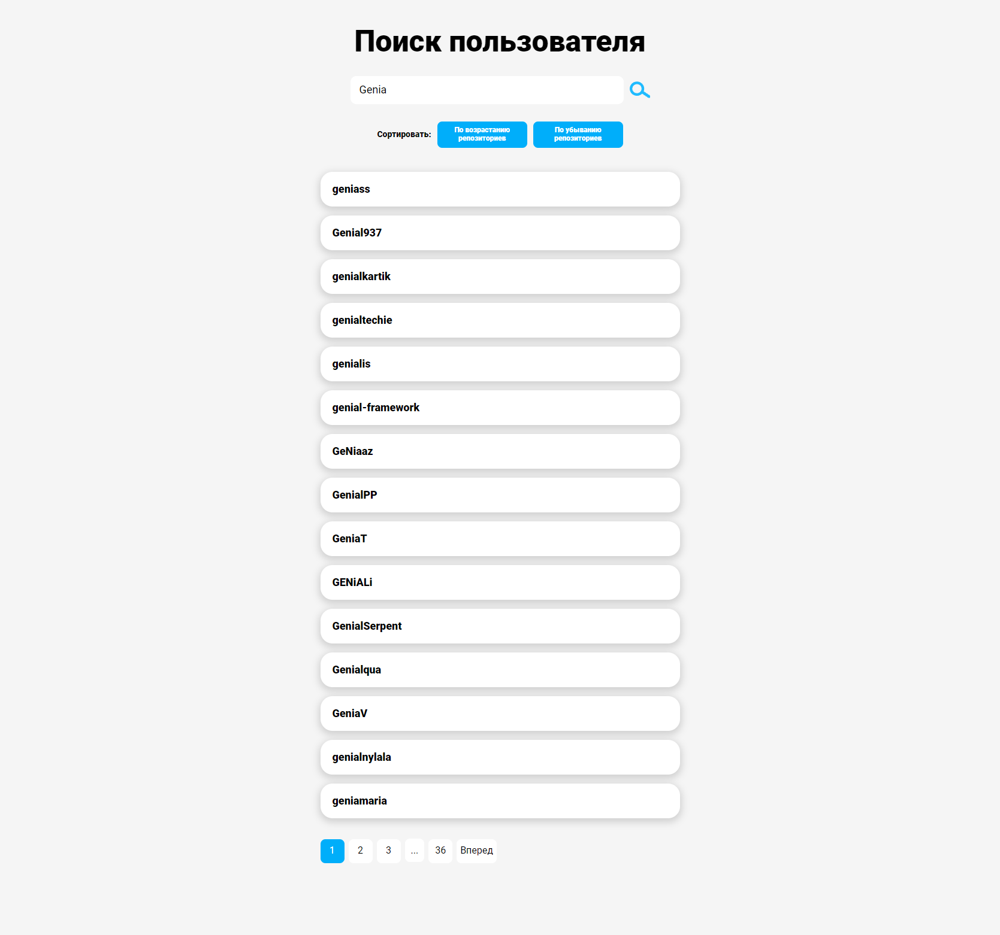

# Интерфейс поиска пользователей по логину

## (тестовое задание SkyEng)

## Задание

Необходимо реализовать интерфейс поиска пользователей.
Данные по пользователям берутся с **https://api.github.com/search/users?q={имя пользователя}** ([документация](https://developer.github.com/v3/search/#search-users))

**Требования:**
- Поиск: по логину
- Сортировка: по количеству репозиториев (возрастанию/убыванию)
- Использовать React
- Пагинация
- При клике на элемент - открываются подробности (как и какие на усмотрение разработчика)
- Реализовать 3 юнит-теста на функционал. 

## Реализация


Интерфейс реализован для просмотра на разрешении экрана **1920х1080 px.**
**Верстка адаптирована** под мобильные устройства, но красоте верстки уделено не много внимание, чтобы сдать работу в короткие сроки.
В ТЗ требуется организация функционала, поэтому верстке уделено не так много времени, а упор сделан на функционал.

При нажатии на **иконку поиска,** происходит выдача результатов.
**На одной стаинице показывается 15 записей.** Для перемещения по выдаче имеется навагация по страницам и кнопки назад/вперед.
Для сортировки по количеству репозиториев предназначены соответствующие кнопки.



**При нажатии на логин** в модальном окне открываются дополнительные детали пользователя.


По задению также необходимо написать 3 юнит-теста.
Для запуска тестов необходимо воспользоваться командой:
```sh
npm test
```

## Stack
HTML, CSS, JavaScript, React, TypeScrip, Redux Toolkit, React Router, Jest

## Запуск проект

Необходима установка [Node.js](https://nodejs.org/en).

Установите завистимости:
```sh
npm i
```

Запустите приложение командой:
```sh
npm run start
```
